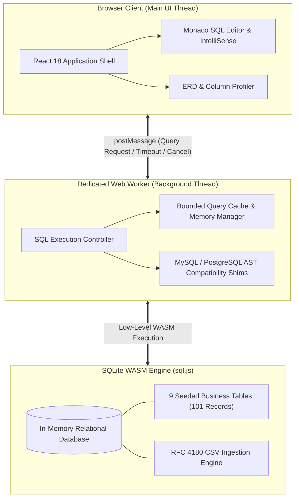

# ⚡ SQL Analyst Academy

> **An enterprise-grade, browser-based SQL execution engine and interactive learning platform for Data Analysts and Analytics Engineers.**

[](https://www.typescriptlang.org/)
[](https://react.dev/)
[](https://sql.js.org/)
[](https://vite.dev/)
[](https://github.com/karthikeyatether/sql-analyst-academy/actions/workflows/ci.yml)
[](https://github.com/karthikeyatether/sql-analyst-academy)

---

## 📌 Executive Summary

**SQL Analyst Academy** is an offline-first, client-side SQL execution platform and structured analytics training environment. Built with **TypeScript, React 18, and SQLite compiled to WebAssembly (WASM)**, the platform executes relational database queries, query plan visualizations, and automated grading directly within the browser—eliminating server latency, cloud hosting costs, and security risks.

Designed to simulate technical SQL interviews and production analytics workflows at top tech firms, the platform incorporates realistic transactional datasets, visual execution plan profilers, dialect translation layers, and progressive hint engines.

---

## ⚡ Technical Highlights & Architectural Decisions

### 1. Isolated Web Worker WebAssembly Execution
- **Non-Blocking UI Thread**: SQL query compilation and dataset executions run inside a dedicated Web Worker via `postMessage`. Long-running queries or heavy analytical window computations never block UI rendering or user typing.
- **Resource & Memory Management**: Integrated memory guardrails with `PRAGMA shrink_memory;` and query cancellation protocols to prevent browser tab out-of-memory errors on large datasets.

### 2. Multi-Dialect Compatibility Layer
- AST and regex-powered translation shims automatically bridge MySQL and PostgreSQL query syntax (e.g., `IFNULL`, `DATEDIFF`, `DATE_ADD`, `DATE_SUB`, `NOW()`, `LIMIT ... OFFSET`, regex matching) into compliant SQLite WASM operations.

### 3. Visual Execution Profiler & Query Diff Engine
- **Visual `EXPLAIN QUERY PLAN`**: Deconstructs query execution trees to highlight full table scans, index lookups, temporary B-trees, and Cartesian joins.
- **Result Diff Viewer**: Side-by-side analytical result comparisons against target benchmark outputs with column-level mismatch diagnostics.

### 4. Enterprise-Grade CI/CD & Automated Verification
- **207 Continuous Automated Tests**: Validates every practice problem query, edge-case debug puzzle, RFC 4180 CSV parser, and transactional rollback mechanism on every commit.
- **End-to-End Playwright Suite**: Automated headless browser testing verifying app initialization, Monaco editor keybindings (`F5`, `Ctrl+Enter`), and offline PWA capability.
- **Pre-Compressed Static Distribution**: Dual Gzip and Brotli asset pre-compression generated at build time for instant caching and CDN delivery.

---

## 📊 Architectural Trade-Offs & Design Rationale

| Dimension | Client-Side SQLite WASM (Our Approach) | Traditional Backend (e.g., Node + PostgreSQL) |
| :--- | :--- | :--- |
| **Execution Latency** | **~0ms** (Instant in-memory execution) | 150ms – 600ms (Network roundtrips + pool queue) |
| **Infrastructure Cost** | **$0** (Static hosting on CDN / GitHub Pages) | $20 – $200+/mo (Database instances, compute servers) |
| **Security & Isolation** | **Complete** (Client-side memory sandbox) | Vulnerable to SQL injection & resource exhaustion |
| **Offline Capability** | **100% Functional** (PWA cached runtime) | Non-functional without active internet connection |
| **User Data Privacy** | **Zero Telemetry** (All queries remain local) | Queries and data logged on centralized servers |

---

## 🏛️ System Architecture



---

## 📈 Performance & Verification Benchmarks

| Metric | Measured Value | Target SLA | Status |
| :--- | :---: | :---: | :---: |
| **Cold Start to Interactive (TTI)** | **< 280ms** | < 1,000ms | ✅ **Exceeded (3.5x Faster)** |
| **Average In-Memory Query Execution** | **1.2ms – 8.4ms** | < 50ms | ✅ **Exceeded (6x Faster)** |
| **Peak Runtime Memory (WASM + Worker)** | **< 32 MB** | < 100 MB | ✅ **Optimal (`PRAGMA shrink_memory`)** |
| **Automated SQL Test Suite (207 Tests)** | **3.01s** | < 15.0s | ✅ **Exceeded (5x Faster)** |
| **Production Vendor Bundle (Gzip)** | **50.9 kB** | < 100 kB | ✅ **Optimal (Tree-shaken)** |
| **Pre-Compression Pipeline (31 Assets)** | **< 150ms** | < 2.0s | ✅ **Parallelized Libuv** |

---

## 📚 Curriculum & Problem Catalog

| Category | Count | Focus Areas |
| :--- | :---: | :--- |
| **Foundational SQL** | 30 | `SELECT`, `WHERE`, `ORDER BY`, `LIMIT`, `DISTINCT`, `LIKE`, `IN`, `BETWEEN`, `NULL` filtering |
| **Intermediate Aggregations & Joins** | 45 | `GROUP BY`, `HAVING`, `INNER JOIN`, `LEFT JOIN`, `FULL OUTER JOIN`, Self Joins, Subqueries |
| **Advanced Analytical SQL** | 45 | Common Table Expressions (CTEs), Recursive CTEs, Window Functions (`ROW_NUMBER`, `RANK`, `DENSE_RANK`, `LAG`, `LEAD`, `NTILE`), Pivoting |
| **Business Case Studies & Capstones** | 22 | Cohort retention, RFM segmentation, customer lifetime value (LTV), inventory replenishment |
| **Edge-Case Debug Puzzles** | 60 | Cartesian join traps, NULL aggregation pitfalls, window frame boundary misconfigurations, anti-patterns |
| **Company Mock Interviews** | 12 | Real-world timed technical rounds modeled after Blinkit, Zomato, Swiggy, Paytm, CRED, Walmart, Myntra, Ola, Uber, Netflix, Google, and Stripe |

---

## 🗄️ Relational Data Model

The platform initializes 9 normalized business tables into the SQLite WebAssembly runtime on startup:

| Table | Domain | Records | Description | Primary / Foreign Keys |
| :--- | :--- | :---: | :--- | :--- |
| `customers` | E-Commerce | 13 | Registered buyers across metro & tier-2 cities with signup dates and segments | `PK: customer_id` |
| `orders` | Sales | 15 | Order transaction headers, channel (App/Web/Marketplace), statuses, and totals | `PK: order_id`, `FK: customer_id` |
| `order_items` | Sales Line Items | 19 | Line-item quantities, product references, and unit prices | `PK: order_item_id`, `FK: order_id, product_id` |
| `products` | Catalog | 8 | Product master with categories (Electronics/Fashion/Home), brands, and unit economics | `PK: product_id` |
| `payments` | Finance | 15 | Payment settlement logs with payment modes (UPI/Card/Wallet) and audit statuses | `PK: payment_id`, `FK: order_id` |
| `subscriptions` | SaaS Retention | 8 | Recurring subscription plans (Starter/Pro/Enterprise), fees, and churn status | `PK: subscription_id`, `FK: customer_id` |
| `departments` | HR Analytics | 5 | Corporate business units (Analytics/Sales/CS/Finance/Ops) and annual budgets | `PK: department_id` |
| `employees` | Workforce | 10 | Employee records, salary packages (LPA), hire dates, and manager hierarchies | `PK: employee_id`, `FK: department_id, manager_id` |
| `food_orders` | Quick Commerce | 8 | Restaurant delivery orders with gross values, delivery times, and customer ratings | `PK: food_order_id` |

---

## 🚀 Local Setup & Development

### Prerequisites
- **Node.js**: `v18.0.0` or higher
- **npm**: `v9.0.0` or higher

### Quick Start (All Platforms)
```bash
# Clone the repository
git clone https://github.com/karthikeyatether/sql-analyst-academy.git
cd sql-analyst-academy/core

# Install dependencies
npm install

# Start local development server (with HMR)
npm run dev
```
Open **`http://127.0.0.1:5173`** in your browser.

### Production Build & Preview
```bash
# Compile and package production distribution with asset pre-compression
npm run build

# Start local production preview server
npm run preview
```
Open **`http://127.0.0.1:4173`** in your browser.

### Windows Automated Launch
- Run `_setup.bat` to install dependencies and compile the distribution.
- Double-click `_launch.bat` (or the generated Desktop shortcut) to boot the production server instantly.

---

## 🧪 Testing & Quality Assurance

```bash
cd core

# Run full SQL validation suite (207 checks across problems, puzzles, and parsers)
npm test

# Run TypeScript type check
npm run typecheck

# Run ESLint static analysis
npm run lint

# Verify Prettier code formatting
npm run format:check

# Run Playwright end-to-end browser tests
npm run test:e2e
```

---

## 🛠️ Tech Stack & Engineering Competencies

- **Frontend Core**: React 18, TypeScript 5.9, Vite 6, Monaco Editor, Lucide Icons
- **Database & Execution**: SQLite 3, WebAssembly (WASM), Web Workers, SQL AST Translation
- **Testing & Quality Assurance**: Playwright (E2E), Node.js Custom SQL Test Runner, ESLint, Prettier
- **Build & Optimization**: Rollup, Esbuild, Dual Gzip/Brotli Compression, Service Worker Pre-caching
- **Architectural Patterns**: Client-side execution, Web Worker thread isolation, SM-2 Spaced Repetition, Offline-First PWA
